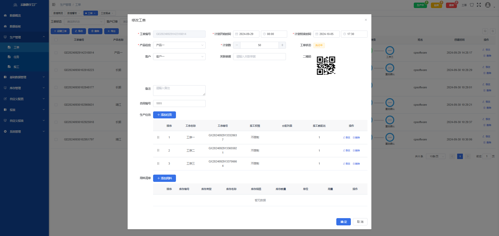

# cp-mes-ruoyi
持续开发中，感兴趣请点star！

#### 介绍
本项目是基于ruoyi开发的生产工单管理系统（mes），权限部分沿用了框架自带的体系，其余功能为定制开发，UI样式做了改造。  
系统提供了一系列生产管理的功能，适用中小生产型企业，满足用户对生产过程的管理需求，个人和企业均可免费自用，但禁止售卖代码获利。

#### 软件架构
前端框架：vue2 + element-ui + ECharts        
后端框架：SpringBoot + Mysql + Redis

#### 在线体验
演示地址：http://cp-mes.cn  
体验账号：18000000000/abc123456

#### 主要功能
 **完整功能请登录系统查看** 
    
0. 基础数据 - 管理不良项、生产工序、工艺路线、产品信息、客户信息
1. 人员管理 - 管理部门、岗位、角色、用户
2. 生产管理 - 管理生产工单、操作报工
3. 报表管理 - 产量统计、不良项分析等
4. 数据管理 - 大屏看板、数据概览
5. 库存管理 - 管理物料、出入库操作
6. 进阶功能
    * 自定义字段
    * 自定义报表
7. 其他功能
    * 个人信息管理
    * 深浅主题切换
    * 平台工单

#### 本地运行
https://www.szcloudpulse.com/mes-run-document.html

#### 界面截图
  
  
  
  
  

支持深浅两种主题，深色效果    
  
  

#### 技术交流&获取使用说明  
公众号上有更多案例  
“云脉软件”公众号  
  

咨询交流请加微信  
 

#### 关于我们
苏州云脉软件技术有限公司  
<a href='https://www.szcloudpulse.com' target='_blank'>www.szcloudpulse.com</a>